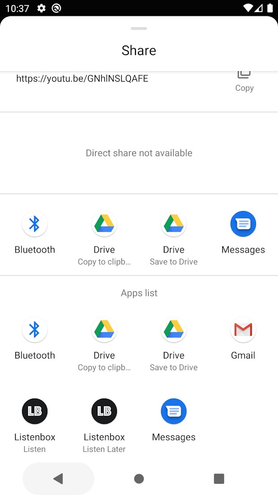

Install Listenbox Android app:

Now you have Listenbox in your share sheet. Tap this button and choose "Listen" from the list:

<button class="focus:outline-none h-12 w-20 rounded-md bg-white text-sm font-bold text-black duration-200 hover:shadow-dark-xl" onclick="(() => navigator.share({ title: 'Richard Feynman Interview', url: 'https://youtu.be/GNhlNSLQAFE', }))()">
    Test it
</button>

    

