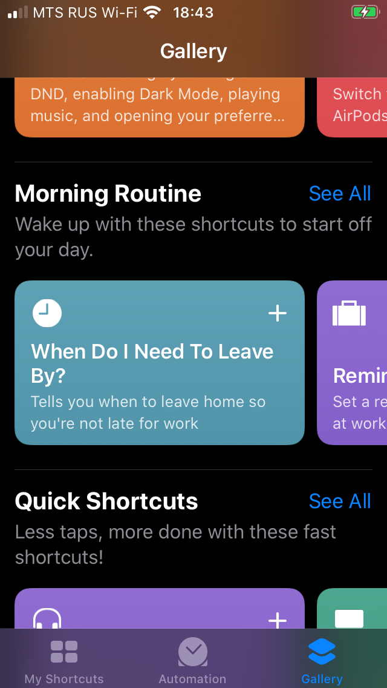
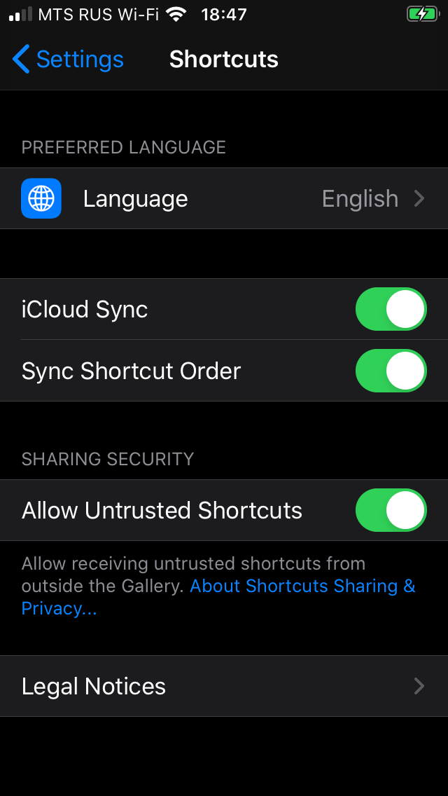
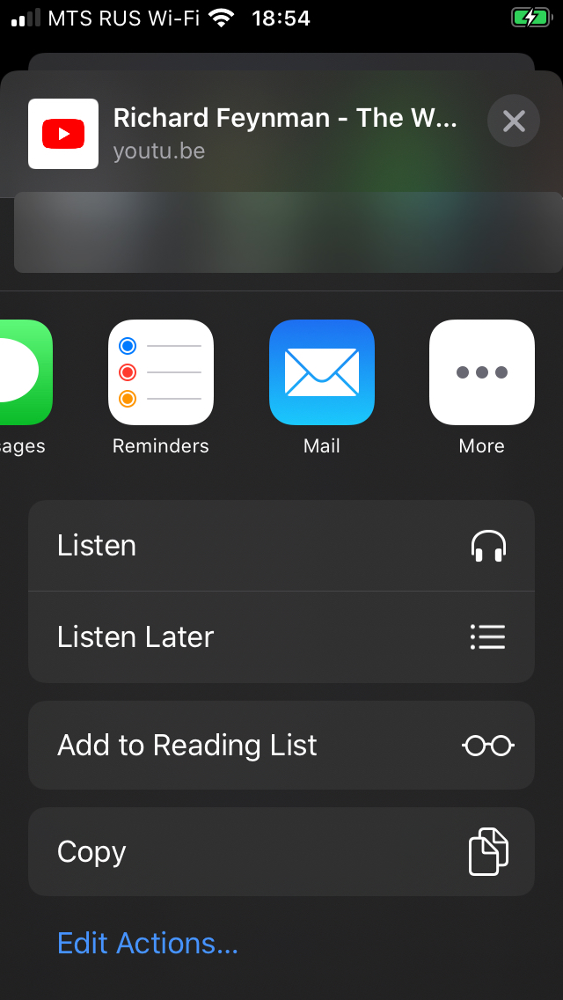

1. Install Shortcuts app if you don't have it already:

   

2. Open Shortcuts app, go to Gallery tab and install any shortcut.
   This is needed for the next step, you can remove it later.

   

3. Go to Settings → Shortcuts and enable "Allow Untrusted Shortcuts".
   This is needed to install third party shortcuts like Listenbox.

   

4. Install [Listen shortcut](https://www.icloud.com/shortcuts/6eab00d02eb24388955e564c0a4ca83d)

5. (Optional) Install [Listen Later shortcut](https://www.icloud.com/shortcuts/3e76fb546067404bb1b47d74af70b741)

Now you have Listenbox in your share sheet. Tap this button and choose "Listen" from the list:

<button class="focus:outline-none h-12 w-20 rounded-md bg-white text-sm font-bold text-black duration-200 hover:shadow-dark-xl" onclick="(() => navigator.share({ title: 'Richard Feynman Interview', url: 'https://youtu.be/GNhlNSLQAFE', }))()">
    Test it
</button>

   

If you don't have a podcast app, Overcast is cool:

