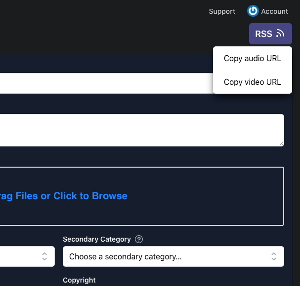
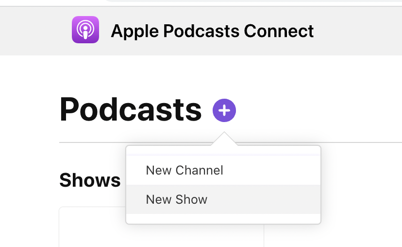
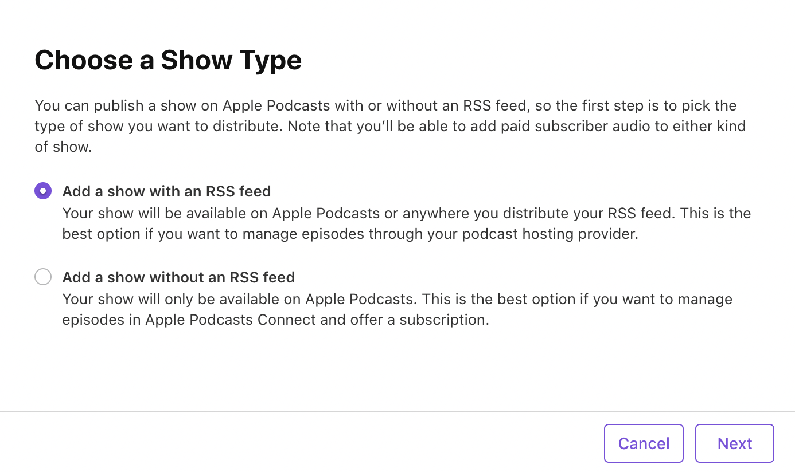
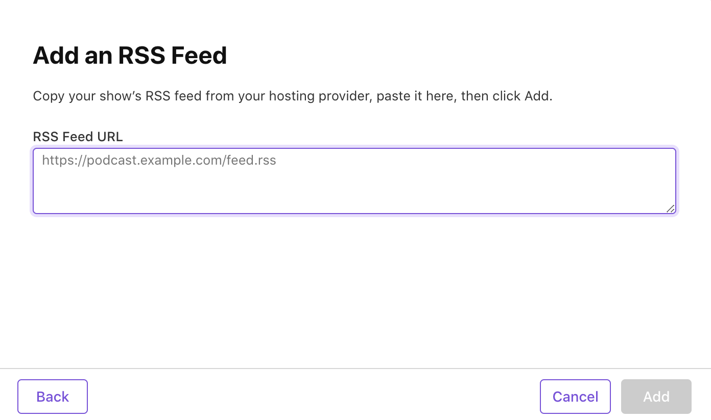
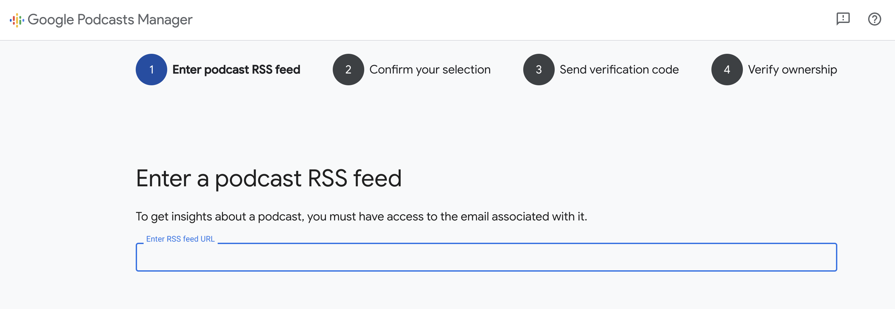
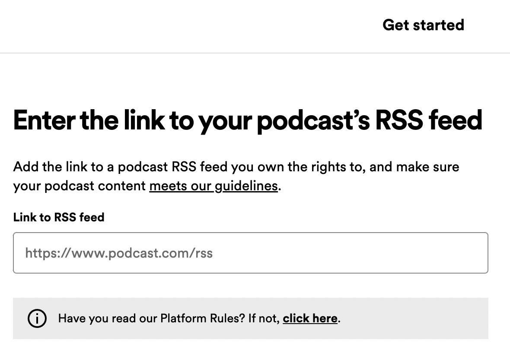

## From a YouTube show to a published podcast in less than 5 minutes

1. [Login to Listenbox](/account) and upgrade your account to [Creator plan](/pricing).
2. Add your YouTube show [on the main page](/).
3. Once it's imported, go to "Edit" and fill out the iTunes required info (Artwork, Category, Owner, Explicit).
4. Copy the RSS URL (Spotify supports only audio, iTunes supports both): 

### ITunes

1. Go to https://podcastsconnect.apple.com/my-podcasts
2. Tap "New Show": 
3. Choose "with RSS feed": 
4. Paste your RSS URL: 
5. Submit it for review. After 3-4 days you'll get an email that your podcast is approved.
   Eventually it'll appear in searches in every podcast app except Google and Spotify.

### Google

1. Go to https://podcastsmanager.google.com/add-feed

2. Paste your RSS URL: 

3. Let Google [verify your feed](https://support.google.com/podcast-publishers/answer/9747492)

### Spotify

1. Go to https://podcasters.spotify.com/dash/submit
2. Paste your RSS URL: 

## Listenbox subscription

As long as you have an active subscription to the [Creator plan](/pricing)
your podcast will be automatically synchronized with YouTube.

If you want _different title and artwork_ for audio and video podcasts, add the same YouTube link again.
It will create a second copy of the show, then you can describe it differently and get separate download stats for audio
and video.
